# Architecture Diagram

End-to-end architecture of the MonkeyDData lakehouse proof-of-concept: data ingestion, Delta Lake build, Postgres mirroring, NSI index construction, and benchmark evaluation.

```mermaid
flowchart TD

    %% ══════════════════════════════════════════
    %% DATA SOURCES
    %% ══════════════════════════════════════════
    subgraph SOURCES["Data Sources — datasource/nyc-taxi/"]
        SRC_Y["yellow_tripdata_*.parquet<br/>(12 monthly files — 2025)"]
        SRC_G["green_tripdata_*.parquet<br/>(12 monthly files — 2025)"]
        SRC_F["fhv_tripdata_*.parquet<br/>(12 monthly files — 2025)"]
        SRC_Z["taxi_zone_lookup.csv<br/>+ static vendor/payment/rate lookups"]
    end

    %% ══════════════════════════════════════════
    %% DAGSTER PIPELINE
    %% ══════════════════════════════════════════
    subgraph DAGSTER["Dagster — rebuild_lakehouse job — dagster-project/"]
        A_DIMS["delta_dimensions asset<br/>────────────────<br/>source_data.load_static_dimensions()<br/>source_data.build_base_dimension()<br/>delta_io.write_delta_from_dataframe()"]

        A_FACTS["delta_facts asset<br/>────────────────<br/>fact_queries: yellow_query / green_query<br/>fhv_query / trip_query  (DuckDB SQL)<br/>delta_io.write_delta_from_query()<br/>→ Arrow record batches → deltalake"]

        A_META["metadata_exports asset<br/>────────────────<br/>metadata_io.collect_column_catalog()<br/>metadata_io.collect_column_statistics()<br/>metadata_io.collect_delta_log_entries()<br/>metadata_io.collect_predicate_row_group_index()"]

        A_SNAP_F["current_snapshot_files asset<br/>────────────────<br/>metadata_io.collect_current_snapshot_files()<br/>one row per active Delta parquet file"]

        A_SNAP_S["current_snapshot_file_stats asset<br/>────────────────<br/>metadata_io.collect_current_snapshot_file_stats()<br/>per-file per-column min/max from Delta snapshot"]

        A_PG["postgres_mirror asset<br/>────────────────<br/>postgres_io.load_delta_table_to_postgres()<br/>postgres_io.load_dataframe_to_postgres()<br/>Polars → Arrow → COPY FROM STDIN"]

        A_DIMS --> A_FACTS
        A_FACTS --> A_META
        A_FACTS --> A_SNAP_F
        A_FACTS --> A_SNAP_S
        A_META  --> A_PG
        A_SNAP_F --> A_PG
        A_SNAP_S --> A_PG
    end

    %% ══════════════════════════════════════════
    %% DELTA LAKE
    %% ══════════════════════════════════════════
    subgraph DELTALAKE["Delta Lake — delta-lake/warehouse/"]
        subgraph DIMS["Dimension Tables"]
            DIM_LOC["dim_location"]
            DIM_VEN["dim_vendor"]
            DIM_PAY["dim_payment_type"]
            DIM_RATE["dim_rate_code"]
            DIM_TT["dim_trip_type"]
            DIM_BASE["dim_base"]
        end

        subgraph FACTS["Fact Tables — partitioned: pickup_year / pickup_month"]
            F_Y["fact_trip_yellow<br/>~40 cols — yellow service"]
            F_G["fact_trip_green<br/>~42 cols — adds trip_type / ehail_fee"]
            F_F["fact_trip_fhv<br/>~15 cols — dispatching / affiliated base"]
            F_T["fact_trip<br/>UNION ALL of yellow + green + fhv<br/>nullable cols for non-matching services"]
        end

        DLOG[("_delta_log/*.json<br/>────────────────<br/>add/remove commit actions<br/>per-file minValues / maxValues / nullCount<br/>Delta protocol auto-generates on every write")]
    end

    %% ══════════════════════════════════════════
    %% METADATA EXPORTS
    %% ══════════════════════════════════════════
    subgraph META_EXP["Metadata Exports — delta-lake/metadata_exports/"]
        ME_CAT["column_catalog.parquet<br/>table · column · ordinal · data_type · nullable"]
        ME_STAT["column_statistics.parquet<br/>table · column · row_count · null_count<br/>distinct_count · min/max text"]
        ME_LOG["delta_log_entries.parquet<br/>table · version · entry_type · payload_json"]
        ME_PRG["predicate_row_group_index.parquet<br/>file × row_group × column<br/>typed min/max · 6 value kinds"]
        ME_SF["current_snapshot_files.parquet<br/>one row per active file<br/>column_stats_json blob"]
        ME_SFS["current_snapshot_file_stats.parquet<br/>one row per file × column<br/>null_count · min/max text"]
    end

    %% ══════════════════════════════════════════
    %% POSTGRES
    %% ══════════════════════════════════════════
    subgraph POSTGRES["Postgres 17 — datalake DB — Docker localhost:5432"]
        subgraph MART["mart schema — warehouse mirror"]
            PG_DIM[("dim_location · dim_vendor<br/>dim_payment_type · dim_rate_code<br/>dim_trip_type · dim_base")]
            PG_FACT[("fact_trip_yellow · fact_trip_green<br/>fact_trip_fhv · fact_trip")]
        end

        subgraph PGMETA["metadata schema — catalog + indexes"]
            PG_CAT[("column_catalog")]
            PG_CSTAT[("column_statistics")]
            PG_DLOG[("delta_log_entries")]
            PG_PRG[("predicate_row_group_index<br/>Dagster-mirrored row-group bounds<br/>from Delta snapshot")]
            PG_SF[("current_snapshot_files")]
            PG_SFS[("current_snapshot_file_stats<br/>source for NSI build-index")]
            PG_PFI[("predicate_file_index<br/>━━ NSI File-Level Index ━━<br/>1 row per file × column<br/>typed min/max across 6 value kinds<br/>indexes: table+file · table+column")]
        end

        subgraph PGFOOT["parquet_footer schema — physical footer stats"]
            PG_RGS[("row_group_stats<br/>━━ NSI Row-Group Index ━━<br/>1 row per file × row_group × column<br/>typed min/max + num_rows + byte_size<br/>read from PyArrow parquet footers")]
        end
    end

    %% ══════════════════════════════════════════
    %% NSI INDEX BUILD
    %% ══════════════════════════════════════════
    subgraph NSI_BUILD["NSI Index Build — nsi/indexer.py + nsi/cli.py"]
        NSI1["nsi.cli build-index<br/>────────────────<br/>_read_metadata_frames() from Postgres<br/>build_predicate_index_frame()<br/>normalize_value_kind() → typed columns<br/>_parse_decimal / _parse_timestamp /<br/>_parse_date / _parse_bool<br/>→ to_sql() + CREATE INDEX"]

        NSI2["nsi.cli build-footer-index<br/>────────────────<br/>iter_warehouse_parquet_files()<br/>_footer_row_group_records() per file<br/>PyArrow: metadata.row_group(i).column(j)<br/>build_footer_row_group_stats_frame()<br/>→ to_sql() + CREATE INDEX"]
    end

    %% ══════════════════════════════════════════
    %% BENCHMARK EVALUATION
    %% ══════════════════════════════════════════
    subgraph EVAL["Benchmark Evaluation — nsi/evaluate_*.py"]
        subgraph NSI_PATH["NSI Pruning Path"]
            E_FL["NSI File-Level<br/>evaluate_fact_table.py<br/>────────────────<br/>find_candidate_files()<br/>build_candidate_files_query()<br/>SELECT DISTINCT + EXISTS per predicate<br/>typed column comparisons in SQL"]

            E_RG["NSI Row-Group<br/>evaluate_row_group_fact_table.py<br/>evaluate_row_group_multi_predicate.py<br/>────────────────<br/>correlated SQL EXISTS per predicate<br/>against predicate_row_group_index<br/>→ candidate (file, row_group) pairs"]
        end

        subgraph DLOG_PATH["Delta Log Baseline Path  (comparison)"]
            E_DL["Delta Log Replay<br/>────────────────<br/>glob _delta_log/*.json<br/>replay add/remove → active file set<br/>parse stats JSON per add action<br/>apply minValues/maxValues range test<br/>→ candidate file list"]
        end
    end

    %% ══════════════════════════════════════════
    %% BENCHMARK OUTPUT
    %% ══════════════════════════════════════════
    subgraph OUTPUT["Benchmark Output"]
        OUT_N["predicate_output/label/<br/>────────────────<br/>summary.json<br/>  candidate_file_count<br/>  candidate_row_group_count<br/>  matching_trip_count<br/>matching_trips.parquet<br/>matching_trips.csv<br/>source: NSI index"]

        OUT_D["delta_log_output/label/<br/>────────────────<br/>summary.json<br/>  candidate_file_count<br/>  delta_log_json_files_read<br/>  matching_trip_count<br/>matching_trips.parquet<br/>matching_trips.csv<br/>source: Delta log JSON"]
    end

    %% ══════════════════════════════════════════
    %% EDGES — Section 1: Sources → Dagster → Delta Lake
    %% ══════════════════════════════════════════
    SRC_Y & SRC_G & SRC_F -->|"read_parquet([...])"| A_FACTS
    SRC_Z --> A_DIMS

    A_DIMS -->|"write_delta_from_dataframe()\ndeltalake overwrite"| DIMS
    A_FACTS -->|"write_delta_from_query()\n250k-row Arrow batches"| FACTS
    FACTS -.->|"Delta protocol\nauto-generates on write"| DLOG

    %% ══════════════════════════════════════════
    %% EDGES — Section 2: Delta Lake Metadata → Postgres
    %% ══════════════════════════════════════════
    A_META -->|"export_parquet()"| ME_CAT & ME_STAT & ME_LOG & ME_PRG
    A_SNAP_F -->|"export_parquet()"| ME_SF
    A_SNAP_S -->|"export_parquet()"| ME_SFS

    A_PG -->|"load_delta_table_to_postgres()\n100k-row Arrow batches\nCOPY FROM STDIN"| MART
    ME_CAT -->|"load_dataframe_to_postgres()"| PG_CAT
    ME_STAT -->|"load_dataframe_to_postgres()"| PG_CSTAT
    ME_LOG -->|"load_dataframe_to_postgres()"| PG_DLOG
    ME_PRG -->|"load_dataframe_to_postgres()"| PG_PRG
    ME_SF -->|"load_dataframe_to_postgres()"| PG_SF
    ME_SFS -->|"load_dataframe_to_postgres()"| PG_SFS

    %% ══════════════════════════════════════════
    %% EDGES — Section 3: NSI Index Build
    %% ══════════════════════════════════════════
    PG_SFS & PG_CAT -->|"_read_metadata_frames()\nSELECT * FROM metadata.*"| NSI1
    NSI1 -->|"to_sql if_exists=replace\n+ CREATE INDEX"| PG_PFI

    FACTS -->|"iter_warehouse_parquet_files()\nrglob *.parquet"| NSI2
    NSI2 -->|"to_sql if_exists=replace\n+ CREATE INDEX"| PG_RGS

    %% ══════════════════════════════════════════
    %% EDGES — Section 4: Benchmark Evaluation
    %% ══════════════════════════════════════════
    PG_PFI -->|"build_candidate_files_query()\nSELECT DISTINCT absolute_file_path"| E_FL
    PG_PRG -->|"SQL EXISTS per predicate\ntable+file+row_group join"| E_RG

    DLOG -->|"glob *.json · parse lines\nreplay add/remove actions"| E_DL

    E_FL  -->|"build_duckdb_parquet_scan()\nDuckDB BETWEEN filter"| OUT_N
    E_RG  -->|"build_duckdb_parquet_scan()\nDuckDB conjunctive filter"| OUT_N
    E_DL  -->|"build_duckdb_parquet_scan()\nDuckDB BETWEEN / = filter"| OUT_D
```



---

## Reading the Diagram

### Four flows

| Flow | Start | End | Key files |
|---|---|---|---|
| **1. Ingestion** | `datasource/nyc-taxi/` | Delta Lake warehouse | `fact_queries.py`, `delta_io.py`, `source_data.py` |
| **2. Metadata mirror** | Delta Lake snapshot + logs | Postgres `mart` + `metadata` schemas | `metadata_io.py`, `postgres_io.py` |
| **3. NSI build** | `metadata.current_snapshot_file_stats` + warehouse `.parquet` files | `metadata.predicate_file_index`, `parquet_footer.row_group_stats` | `nsi/indexer.py`, `nsi/cli.py` |
| **4. Benchmark** | NSI indexes + `_delta_log/*.json` | `predicate_output/` vs `delta_log_output/` | `nsi/evaluate_*.py` |

### Two index types compared in benchmarks

| Index | Granularity | Built by | Queried by |
|---|---|---|---|
| `metadata.predicate_file_index` | 1 row per file × column | `nsi.cli build-index` | `evaluate_fact_table.py` |
| `metadata.predicate_row_group_index` | 1 row per file × row_group × column | `metadata_exports` Dagster asset | `evaluate_row_group_*.py` |
| `parquet_footer.row_group_stats` | 1 row per file × row_group × column | `nsi.cli build-footer-index` | Alternative to `predicate_row_group_index` |

### Typed value columns (all three indexes share the same schema pattern)

Each index row stores min/max in six typed column pairs so SQL comparisons are accurate:

```
min_numeric   / max_numeric      ← int · float · double · decimal
min_timestamp / max_timestamp    ← timestamp[*]
min_date      / max_date         ← date
min_boolean   / max_boolean      ← bool · boolean
min_value_text / max_value_text  ← all other types (text fallback)
```

`normalize_value_kind(data_type)` in `nsi/indexer.py` maps catalog type strings to these families.
